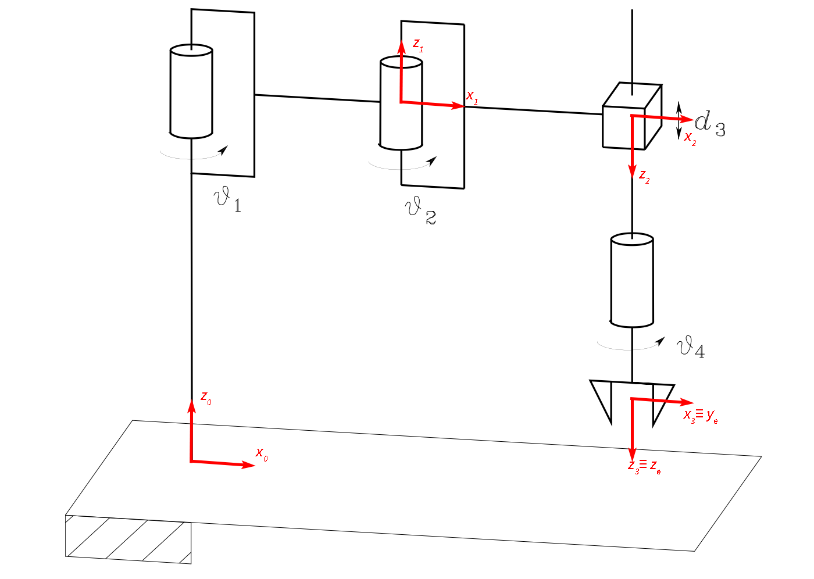

# Technical Project - Foundation of Robotics

## Overview

This project provides an in-depth analysis and implementation of various kinematic and dynamic control strategies for a SCARA robot. The primary focus is on kinematics, trajectory planning, kinematic inversion, and dynamic control. The report presents a comprehensive study of the robot’s behavior and performance across different control methodologies.

  

## Contents

### 1. Kinematics
- **Direct Kinematics**: Determined the transformation matrix using Denavit-Hartenberg parameters and derived the direct kinematics equations.
- **Differential Kinematics**: Computed the geometric Jacobian matrix and simplified it for practical use.
- **Kinematics Singularities**: Analyzed singular configurations and their impact on the robot’s workspace.
- **Manipulability Ellipsoids**: Evaluated the robot’s ability to generate velocities and forces through manipulability ellipsoids.

### 2. Trajectory Planning
- Designed a trajectory for the SCARA robot that includes straight and circular segments with multiple via points.
- Generated velocity and acceleration profiles using trapezoidal motion profiles.
- Illustrated the trajectory path and end-effector orientation changes over time.

### 3. Kinematics Inversion
- Implemented several algorithms for kinematic inversion, including:
  - **Jacobian Inverse**: Computed joint velocities using the inverse Jacobian.
  - **Jacobian Transpose**: Applied Jacobian transpose for a computationally efficient alternative.
  - **Jacobian Pseudo-Inverse**: Utilized pseudo-inverse to handle redundant configurations and optimize dexterity.
  - **Second-Order CLIK**: Integrated joint acceleration into the control strategy for improved motion control.

### 4. Dynamic Model and Control
- **Dynamic Modeling**: Derived the dynamic equations of the robot using Lagrangian mechanics.
- **Robust Control**: Designed a robust control strategy to handle model uncertainties and disturbances.
- **Adaptive Control**: Developed an adaptive control scheme to adjust control inputs in real-time, improving performance with varying payloads.

## Key Results
- Successfully mapped kinematic models and trajectory planning for the SCARA robot.
- Implemented and compared various kinematic inversion algorithms, highlighting their trade-offs and performance.
- Developed dynamic models and control strategies, demonstrating the effectiveness of robust and adaptive control in maintaining desired performance despite uncertainties.

## Tools and Technologies
- MATLAB and Simulink for simulation and algorithm implementation.
- Numerical methods for trajectory planning and control design.

## Authors
- [Andrea Morghen](https://www.linkedin.com/in/andreamorghen/)
- [Salvatore Del Peschio](https://www.linkedin.com/in/sdelpeschio/)

## Supervisor
- [Prof. Bruno Siciliano](https://www.linkedin.com/in/bruno-siciliano-6270832/)

## References
- Robotics: Modelling, Planning and Control; B. Siciliano, L. Sciavicco, L.Villani, G. Oriolo
